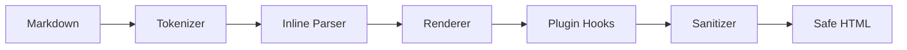

# Litedown - Comprehensive Architecture & Design

## Overview

Litedown is a professional-grade, lightweight, and streaming-first Markdown renderer. It is designed to replace traditional "heavy" rendering stacks in high-performance environments (like LLMs, real-time editors, and documentation engines).

### Core Goals

1.  **Extreme Efficiency**: Total bundle size under **~22KB** (vs ~5MB for traditional stacks).
2.  **Streaming Native**: Checkpoint-based incremental rendering allows O(1) performance during LLM streaming.
3.  **Secure by Design**: Built-in HTML sanitization and URI protocol validation.
4.  **Native Math & Diagrams**: Zero-dependency MathML and SVG Mermaid rendering.

---

## Technical Architecture

Litedown uses a modular pipeline designed for extensibility and performance.

### File Structure

```text
src/
├── lib/
│   ├── core/
│   │   ├── tokenizer.ts      # Block-level parser (headings, lists, code, etc.)
│   │   ├── inline-parser.ts   # Inline parser (bold, links, inline math)
│   │   └── renderer.ts       # HTML generator from tokens
│   ├── plugins/
│   │   └── plugin-api.ts     # Extensibility framework
│   ├── utils/
│   │   ├── escape.ts         # Shared HTML/XML escaping
│   │   └── sanitizer.ts      # Lightweight XSS protection
│   ├── streamdown.ts         # Orchestration & streaming logic
│   ├── types.ts              # Global type definitions
│   └── useStreamdown.ts      # React hook adapter
├── App.tsx                   # High-performance Demo App
└── index.css                 # Premium Light/Dark design system
```

### The Rendering Pipeline



1.  **Tokenizer**: Splits markdown into `BlockToken` objects. It is "streaming-aware," marking tokens as `complete: true/false`.
2.  **Inline Parser**: Processes text within tokens for formatting. Sanitizes `href` protocols (blocks `javascript:`, etc.) during parsing.
3.  **Renderer**: Converts tokens to HTML. Uses specific sub-renderers for MathML, Prism Prism highlighting, and SVG Mermaid diagrams.
4.  **Plugin System**: Allows custom block rules, inline patterns, and HTML post-processing.
5.  **Sanitizer**: An allowlist-based parser that strips dangerous tags and event handlers while preserving MathML/SVG output.

---

## Component Deep Dive

### 1. Streaming Renderer (`streamdown.ts`)

The `StreamdownRenderer` class implements **Checkpoint-based Incremental Rendering**.

- **Committed Tokens**: Fully parsed blocks are cached and never re-parsed or re-rendered.
- **Pending Tokens**: Only the last active block is re-rendered on each `push()`.
- **Performance**: Prevents O(n²) slowdowns during long LLM generations.

```typescript
const renderer = new StreamdownRenderer();
renderer.onUpdate(html => updateUI(html));
renderer.push("### Stream");
renderer.push("ing content..."); // Only handles the heading block
renderer.finish(); // Final cleanup and post-processing
```

### 2. Native MathML (`math-renderer.ts`)

Litedown renders LaTeX to native browser **MathML** elements. 
- **No Fonts Required**: Uses system fonts for universal math display.
- **Accessibility**: MathML is natively readable by screen readers.
- **Zero Bundle Size**: No KaTeX/MathJax dependency.

### 3. SVG Mermaid Diagrams (`mermaid-renderer.ts`)

A lightweight tokenizer specifically for Mermaid syntax that generates pure SVG. 
- **Supported**: Flowcharts, Sequence Diagrams, and Pie Charts.
- **Self-Contained**: No external rendering engines or heavy layout libraries.

### 4. HTML Sanitizer (`sanitizer.ts`)

A ~1.5KB allowlist-based sanitizer.
- **Blocked**: `<script>`, `<iframe>`, `onclick`, `javascript:` URIs.
- **Allowed**: Standard formatting, Tables, MathML elements, and SVG primitives.

---

## Design System (`index.css`)

The included design system provides a **Premium Light Theme** (with Slate/Indigo accents) and sets up the following component classes:

| Class | Purpose |
| :--- | :--- |
| `.sd-app` | Main container and typography source |
| `.sd-navbar` | Glassmorphism navigation bar |
| `.sd-content` | Scope for rendered markdown content |
| `.sd-btn-*` | Gradient-enhanced buttons |
| `.sd-callout` | Typed information boxes (Note, Tip, Warning) |
| `.sd-cursor` | Animated streaming indicator |

---

## Bundle Comparison

| Feature | Traditional | Litedown | Savings |
| :--- | :--- | :--- | :--- |
| **Math** | KaTeX (~1.5MB) | MathML (0KB) | 100% |
| **Syntax** | Shiki (~2MB) | Prism (~17KB) | 99.1% |
| **Diagrams** | Mermaid (~1.5MB) | SVG (~5KB) | 99.6% |
| **Parser** | Marked (~20KB) | Litedown (~2KB) | 90% |
| **Total** | **~5.0MB** | **~22KB** | **99.5%** |

---

## Performance Benchmark

- **Initial Load**: Fast enough to be non-blocking on low-end mobile devices.
- **Streaming Latency**: <1ms per character push.
- **Memory Footprint**: Modular token caching ensures minimal GC pressure.

---

## NPM Publishing Guide

See the `NPM Publishing Guide` section in the original documentation for build configuration (`vite.config.ts`) and version management steps.